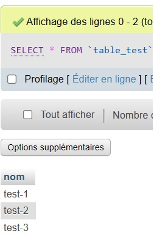
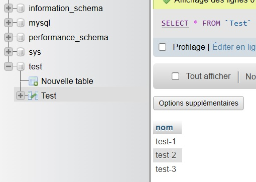

- Récupérer l’image sur le Docker Hub
```bash
docker pull nginx
```

- Vérifier que cette image est présente en local
```bash
docker images | grep nginx
```

- Créer un fichier index.html simple
```bash
touch index.html && echo "test" > index.html
```

- Démarrer un conteneur et servir la page html créée précédemment à l’aide d’un volume
```bash
docker run --name nginx -v ${PWD}/index.html:/usr/share/nginx/html/index.html -d -p 8080:80 nginx
```

- Supprimer le conteneur précédent et arriver au même résultat que précédemment à l’aide de la commande docker cp
```bash
docker container stop nginx 
docker container rm nginx
docker run --name nginx -d -p 8080:80 nginx
docker cp index.html nginx:/usr/share/nginx/html/
```

- A l’aide d’un Dockerfile, créer une image
```bash
touch Dockerfile
```
```yaml
FROM nginx:latest
COPY index.html /usr/share/nginx/html/
```
```bash
docker build -t nginx_custom_image .
```

- Exécuter cette nouvelle image de manière à servir la page html
```bash
docker run --name nginx_custom -d -p 8080:80 nginx_custom_image
```

- Quelles différences observez-vous entre les procédures 5. et 6. ?
```
Les procédures 5. et 6. nous permette toutes deux d'exécuter un serveur web dans un conteneur docker.

La procédure 5. ne demande pas de créer un Dockerfile et de construire une image personnalisé et donc pour pouvoir servir une page html personnalisé avec cette procédure il faut ajouter des étapes suplémentaire comme le fait de mettre en place un volume ou de directement copier le fichier html dans le conteneur.

Contrairement à la procédure 5., la 6. nous demande de créer un Dockerfile et de construire une image personnalisé, ça nous permet de surcharger l'image de base (FROM) afin de simplifier les étapes suivante. De ce fait j'ai pu inclure dans mon image personnalisé la copie de mon fichier html et donc je n'ai pas besoin d'exécuter la commande "docker cp".
```

- Avantages et inconvénients de l’une et de l’autre méthode
```
La procédure 5. est plus accéssble mais ne nous laisse pas la possibilité de surcharger une image facilement.
La procédure 6. demande un peu plus d'éffort mais nous permet de surcharger une image de base à souhait.
```

- Récupérer les images mysql:5.7 et phpmyadmin/phpmyadmin depuis le Docker Hub
```bash
docker pull mysql:5.7
docker pull  phpmyadmin/phpmyadmin
```

- Exécuter deux conteneurs à partir des images
```bash
docker run --name mysql -e MYSQL_ROOT_PASSWORD=secret -d mysql:5.7
docker run --name phpmyadmin -d --link mysql:db -p 8080:80 phpmyadmin/phpmyadmin
```

- Ajouter une table ainsi que quelques enregistrements dans la base de données à l’aide de phpmyadmin


- Faire la même chose que précédemment en utilisant un fichier docker-compose.yml
```bash
touch docker-compose.yml
```
```yaml
services:
  db:
    container_name: mysql
    image: mysql:5.7
    environment:
      MYSQL_ROOT_PASSWORD: secret
    volumes:
      - ./initdb.sql:/docker-entrypoint-initdb.d/initdb.sql

  phpmyadmin:
    container_name: phpmyadmin
    image: phpmyadmin/phpmyadmin
    depends_on:
      - db
    ports:
      - 8080:80
```

- Qu’apporte le fichier docker-compose par rapport aux commandes docker run ?  Pourquoi est-il intéressant ?
```
Le fichier docker-compose permet de créer une configuration pour plusieurs conteneurs, tandis que la commande docker run n'est destiné qu'à démarrer un seul conteneur.

Le fichier docker-compose permet aussi d'abstraire toute la configuration spécifique au conteneur, par exemple, je peux spécifier le mapping de ports, volumes, nom, image, liens, etc.

De se fait, au lieu de devoir taper plusieurs commande docker run avec tous les arguments nécéssaire, je peux, grâce au docker-compose, uniquement taper la commande "docker compose up".

Il est donc très intérréssant d'utiliser un docker-compose pour simplifier et harmoniser le workflow de démarrage de conteneur(s) docker.
```

- Quel moyen permet de configurer (premier utilisateur, première base de données, mot de passe root, …) facilement le conteneur mysql au lancement ?
```
Lorsqu'un conteneur mysql est démarré pour la première fois, il exécutera les fichiers avec les extensions .sh, .sql et .sql.gz qui se trouvent dans /docker-entrypoint-initdb.d. Donc je peux monter un volume qui va binder un fichier .sql au dossier qui fait office d'entrypoint. Si le conteneur à déja était initialisé, alors le script ne va pas s'exécuter.
```
```bash
touch initdb.sql
```
```sql
CREATE DATABASE test;
USE test;

CREATE TABLE Test (nom varchar(255));

INSERT INTO Test (nom) VALUES ('test-1');
INSERT INTO Test (nom) VALUES ('test-2');
INSERT INTO Test (nom) VALUES ('test-3');
```
```yaml
services:
  db:
    container_name: mysql
    image: mysql:5.7
    environment:
      MYSQL_ROOT_PASSWORD: secret
    volumes:
      - ./initdb.sql:/docker-entrypoint-initdb.d/initdb.sql

  phpmyadmin:
    container_name: phpmyadmin
    image: phpmyadmin/phpmyadmin
    depends_on:
      - db
    ports:
      - 8080:80
```
```bash
docker compose up
```


